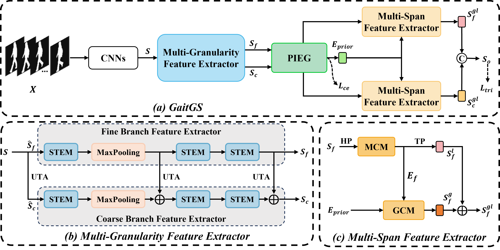
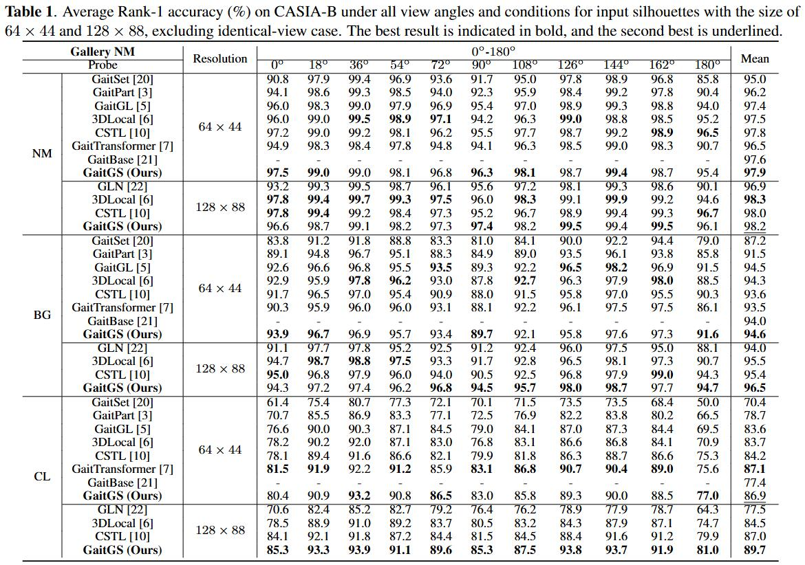
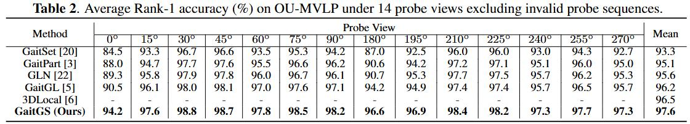

<div align="center">

# GaitGS

## [GaitGS: Temporal Feature Learning in Granularity and Span Dimension for Gait Recognition](https://arxiv.org/abs/2305.19700)

[Haijun Xiong](https://scholar.google.com/citations?hl=zh-CN&user=GDTyz2kAAAAJ),
[Yunze Deng](https://github.com/K2SO4-DYZ),
[Bin Feng](https://scholar.google.com/citations?hl=zh-CN&user=nRc8u6gAAAAJ)  <sup>✉️</sup>,
[Wenyu Liu](https://scholar.google.com/citations?hl=zh-CN&user=nRc8u6gAAAAJ),
[Xinggang Wang](https://scholar.google.com/citations?hl=zh-CN&user=qNCTLV0AAAAJ)

[School of EIC, HUST](http://english.eic.hust.edu.cn/)

<br>

**Our paper has been accepted at [ICIP 2024](https://2024.ieeeicip.org/). 🎉**


---
## Abstract

<div align="left">

Gait recognition, a growing field in biological recognition technology, utilizes distinct walking patterns for accurate individual identification. However, existing methods lack the incorporation of temporal information. To reach the full potential of gait recognition, we advocate for the consideration of temporal features at varying granularities and spans. This paper introduces a novel framework, **GaitGS**, which aggregates temporal features simultaneously in both **granularity** and **span** dimensions. Specifically, the **Multi-Granularity Feature Extractor (MGFE)** is designed to capture micro-motion and macro-motion information at fine and coarse levels respectively, while the **Multi-Span Feature Extractor (MSFE)** generates local and global temporal representations. Through extensive experiments on two datasets, our method demonstrates state-of-the-art performance, achieving **Rank-1 accuracy of 98.2\%, 96.5\%, and 89.7\% on CASIA-B** under different conditions, and **97.6\% on OU-MVLP**.


---
<div align="center">

## Framework




---
## Usage

<div align="left">

### 1. Training

```shell
CUDA_VISIBLE_DEVICES=0,1,2,3 torchrun --nproc_per_node=4 opengait/main.py --cfgs ./configs/gaitgs/gaitgs.yaml --phase train --log_to_file
```
or
```shell
sh train.sh
```


### 2. Testing

```shell
CUDA_VISIBLE_DEVICES=0,1,2,3 torchrun --nproc_per_node=4 opengait/main.py --cfgs ./configs/gaitgs/gaitgs.yaml --phase train --log_to_file
```
or
```shell
sh test.sh
```


  Note: You can find the corresponding .yaml file in `./configs/` , where you can adjust the configurations for training and testing. Additionally, you can refer to the commands provided in `train.sh` and `test.sh`.

---

<div align="center">

## Results

<div align="left">

### 1.Results on CASIA-B

<div align="center">



<div align="left">

### 2.Results on OU-MVLP

<div align="center">




---
## Citation

<div align="left">

If you find our paper and code useful for your research, please consider giving this repo a star :star: or citing :pencil::

```BibTeX
@inproceedings{xiong2023gaitgs,
  title={GaitGS: Temporal Feature Learning in Granularity and Span Dimension for Gait Recognition},
  author={Xiong, Haijun and Deng, Yunze and Feng, Bin and Wang, Xinggang and Liu, Wenyu},
  booktitle={2024 IEEE International Conference on Image Processing (ICIP)},
  year={2024}
}
```

---

<div align="center">

## Acknowledgements

<div align="left">

The development of GaitGS is built on [OpenGait](https://github.com/ShiqiYu/OpenGait), and we are thankful for the remarkable work of the prior project.


